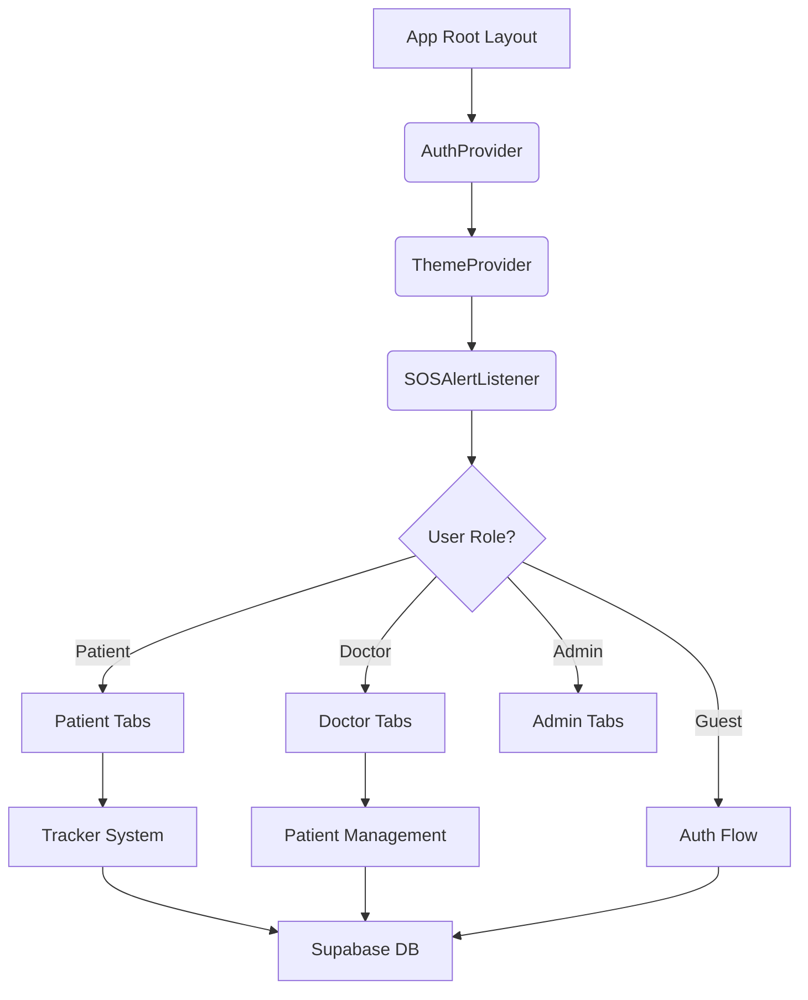

# Application Component Architecture

This document provides a high-level overview of the **Diabetes Control** application's technical architecture, explaining how the different parts of the system interact and how the code is organized.

---

## 1. Core Architecture Pattern
The app is built using **Expo (React Native)** with **Expo Router**, which implements a file-system-based routing system.

### Global Wrappers (`app/_layout.tsx`)
The root layout wraps the entire application in global context providers:
- **`AuthProvider`**: Manages Supabase authentication state, user roles (Patient/Doctor/Admin), and profile synchronization.
- **`ThemeProvider`**: Provides dynamic color tokens for Light, Dark, and System modes.
- **`SOSAlertListener`**: A global background component that monitors for emergency alerts across the entire app.

---

## 2. Directory Structure

### `app/` (Routing & Screens)
The core of the application logic is split into role-based groups:
- **`(auth)/`**: Handles onboarding. Screens: `login`, `signUp`, `profileSetup`.
- **`(patient)/`**: The patient-facing experience.
  - `feed`: AI-assisted health community.
  - `tracker`: The hub for logging daily health data.
  - `emergency`: One-click SOS and emergency contact management.
  - `tracker/`: Sub-folder for specific logs (Glucose, Nutrition, Activity, Wellbeing).
- **`(doctor)/`**: The healthcare professional side.
  - `patients/`: List and detailed view of assigned patients.
  - `instructions`: Management of medical advice sent to patients.
- **`(admin)/`**: System-wide oversight (Stats, User Management, Map view).

### `components/` (UI Building Blocks)
Shared components used across multiple screens:
- **`Select.tsx`**: A searchable, multi-purpose dropdown supporting both simple lists and complex objects.
- **`SOSAlertListener.tsx`**: Logic for showing system-wide emergency overlays.
- **`patient/`**: Specialized components for the patient dashboard (e.g., `LogCards`).
- **`screens/`**: High-level structural components for screen layouts.

### `context/` (Global State)
- **`AuthContext.tsx`**: The "Brain" of the app. Handles login/logout, role checking, and real-time profile fetching.
- **`ThemeContext.tsx`**: Manages visual tokens and accessibility settings.

### `hooks/` (Reusable Logic)
- **`useAuth.ts`**: Quick access to session and profile details.
- **`useTheme.ts`**: Access to dynamic colors and styling factories.
- **`useTracking.ts`**: Specialized hook for fetching and calculating health trends (HbA1c estimation, glucose averages).

---

## 3. Data & Communication Layer

### Supabase Integration
- **Auth**: Email/Password and Session management.
- **Database (PostgreSQL)**: Handles relational data (Profiles, Trackers, Instructions, Alerts).
- **Storage**: Used for profile avatars and medical attachments.
- **Real-time**: Leveraged for chat messages and emergency alert broadcasts.

### Internationalization (`i18next`)
- Localized strings are stored in `assets/locales/` (`en.json`, `ar.json`, `fr.json`).
- The app supports dynamic RTL (Right-to-Left) switching for Arabic.

---

## 4. Component Interaction Flow

---

## 5. Coding Standards
- **Style Injection**: We use a `createStyles` factory pattern within components to keep styles theme-aware and performant via `useMemo`.
- **Atomic Components**: Small UI parts (labels, inputs) are kept as local functions within screens or moved to the `components` folder if reused > 2 times.
- **Type Safety**: TypeScript interfaces define the shape of all data (Patients, Enums, Forms).
